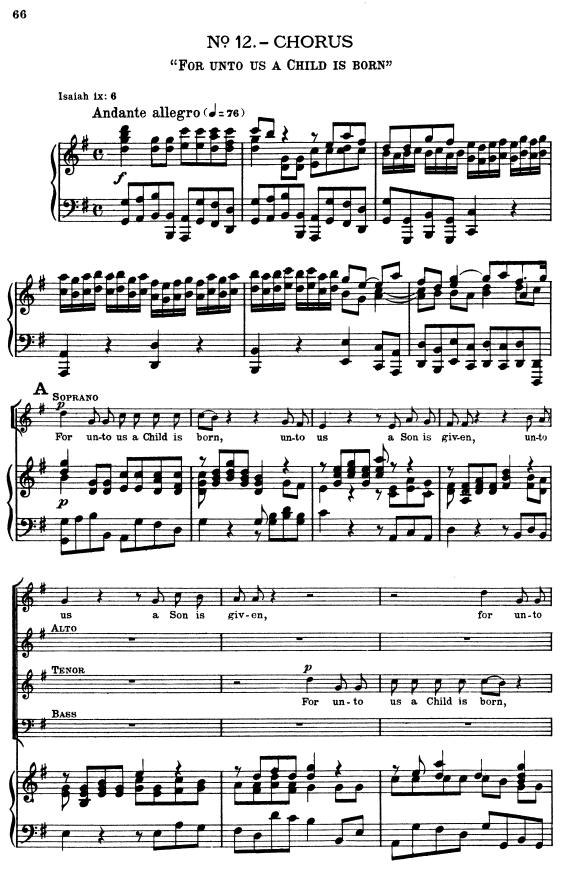

# Ensemble

**Ensemble** is a domain-specific programming language for creating musical programs in a way intuitive to those familiar with sheet music. 

Ensemble uses [scientific pitch notation](https://www.musicandtheory.com/an-easy-guide-to-scientific-pitch-notation/) and other grammatical elements recognizable by musicians. It is meant to be used by those with little to no programming experience as well as experienced programmers.


## Usage

Ensemble files have the following characteristics (Note: This order must be followed.): 
* `Title`
* `Tempo`
* `Time Signature`
* `Transpose` (optional)
* At least one line of music
* Comments, which are specified by `#` (everything that comes after `#` to the end of the line is ignored)

Here is an example of a basic Ensemble file that plays `C4` four times:

    Title: "My Basic Ensemble File"
    Tempo: 100
    Time Signature: 4/4
    Transpose: +12  # THIS LINE IS OPTIONAL

        [C4, C4, C4, C4]

### Title

`Title` can be made up of any characters enclosed in double quotation marks. (The only exception to this are double quotation marks themselves, which are not allowed in the `Title`. If you need to use quotation marks in the `Title`, use single quotation marks.)

### Tempo

`Tempo` always refers to quarter notes beats per minute (BPM). This number can be anywhere in range `1` to `240`.

### Time Signature

`Time Signature` is very flexible and can be chosen from many common (and uncommon) time signatures, including `4/4` (common time), `3/4` (waltz time), `2/4` (cut time), `6/8` (compound duple), `9/8` (compound triple), `12/8` (compound quadruple), `5/4`, `7/8`, `3/8`, `2/2` (alla breve), `4/2`, `5/8`, `7/4`, `11/8`, `6/4`, `9/4`, `13/8`, `15/8`, `10/8`, `3/2`, `2/8`, `4/16`, `3/16`, `5/16`, `6/16`, `7/16`, `9/16`, `12/16`, `9/32`, `12/32`, `5/2`, `7/2`, `13/4`, `21/8`, and `17/16`.

### Transpose

`Transpose` is an optional line that allows you to specify how many half steps to transpose the notes in your Ensemble file. You must have either `+` or `-` before the number on this line so that Ensemble knows whether to transpose to a higher pitch or lower pitch respectively. This number can be anywhere in range `-50` to `+50`.

### Lines of Music/Parts

Every Ensemble file consists of one or more lines of music, each of which is a separate part or voice. A line of music begins with `[` and ends with `]`. Between these square brackets, there are [notes](#notes), separated by [measures](#measures). The total quantity of notes/beats in each measure must follow your `Time Signature`. For example, if you specify your `Time Signature` as `4/4` then you must have enough notes in the measure that their length combined is that of four quarter notes. (Note: Ensemble will throw an error if there is an incorrect number of notes/beats in one of your measures.)

Note the distinction that each line of music in Ensemble is a part and not the same as a line of sheet music. In sheet music, you may have 10 lines of music in a song, each line containing multiple parts. In Ensemble, you have one line per part in a song so that each line extends to the end of the song.

For example, in the following sheet music there are four vocal parts - soprano, alto, tenor, and bass - each of which would be one line in an Ensemble file. (If you wanted the accompaniment, you would need to add more lines/parts accordingly.)


*Sheet music from [free-scores.com](https://www.free-scores.com/)*

The four vocal parts can be represented as follows in Ensemble:

    Title: "No. 12 - CHORUS, 'For Unto Us a Child Is Born'"
    Tempo: 76
    Time Signature: 4/4

        # Soprano part
        [<<the entire soprano part goes here>>]
        
        # Alto part
        [<<the entire alto part goes here>>]

        # Tenor part
        [<<the entire tenor part goes here>>]

        # Bass part
        [<<the entire bass part goes here>>]

I intentionally left out the implementation of the notes in each part to focus on the conversion from sheet music into an Ensemble program. Now that we understand implementation for lines of music/parts in an Ensemble program, we are ready to tackle implementing notes.

### Notes

#### Note

Notes in Ensemble follow [scientific pitch notation](https://www.musicandtheory.com/an-easy-guide-to-scientific-pitch-notation/). Each note must be followed by a comma - unless it is the last note in the measure, in which case it is followed by a bar (see [Measures](#measures)). You can add a sharp or a flat by typing `#` or `-` respectively after the note (i.e., `C4#`, `B3-`).Optionally, notes can also be shortened by adding a slash and then the number you would like to divide them by (i.e., `C4/4` is middle C with its specified length divided by 4).

#### Rest

Rests in Ensemble are shown by two dashes `--`. Just like notes, rests can be shortened by adding a slash and divisor (i.e., `--/4`).

#### Held notes

Held notes in Ensemble are shown by two tildes `~~` following the note to be held (i.e., `C4#, ~~, ...`). Unlike notes and rests, the hold itself cannot be shortened and will always add the full note length to the associated note as specified by the time signature. If you would like to shorten the length of the note, you must shorten the note directly and not the hold. 

As an example, to hold a quarter note for an extra eighth note beat you must do the following (Note: This example assumes that the `Time Signature` is `4/4`):

DO: `C4/2, ~~, ...`

DON'T: `C4, ~~/2, ...`


### Measures

Measures in Ensemble are shown by a single bar `|`. Each measure must be the correct length as specified by the `Time Signature` (i.e., `4/4` requires four quarter notes).


## Installation


[Windows](#windows-installation)

[MacOS](#macos-installation)

[Debian/Ubuntu Linux](#linuxunix-installation)


___
#### Windows Installation:
1. Download Python 3+: 

    [Install Python3 for Windows](https://www.python.org/downloads/windows/)

2. Add Python to your PATH environment variables: 

    [Add Python to PATH on Windows](https://realpython.com/add-python-to-path/#how-to-add-python-to-path-on-windows)

3. Ensure `pip` is installed on your computer by running `pip -V` in the CLI. If not, follow the download instructions for pip here: 
    
    [Install pip](https://pip.pypa.io/en/stable/installation/)

4. Ensure `git` is installed on your computer by running `git version` in the terminal. If not, follow these instructions: 

    [Install git](https://github.com/git-guides/install-git#install-git-on-windows)
    
5. Change folders to the folder where you would like to download Ensemble; then, clone this repo onto your machine by running `git clone https://github.com/dhodgdon/ensemble.git`.
6. Run `cd ensemble` to change directories to the top-level directory of Ensemble.
7. Run `pip install .`.
8. [Run Ensemble!](#running-ensemble)


#### MacOS Installation:

1. Download Python 3+ (if given the option, include pip3 in the download): 
    
    [Install Python3 for MacOS](https://www.python.org/downloads/macos/)

2. Python should be added to your PATH variables. Run `python3 --version` to confirm your system can find the correct version of Python. If not, add Python to your PATH environment variables: 

    [Add Python to PATH on MacOS](https://realpython.com/add-python-to-path/#how-to-add-python-to-path-on-linux-and-macos)

3. Ensure `pip3` is installed on your computer by running `pip3 -V` in the CLI. If not, follow the download instructions for pip here: 

    [Install pip](https://pip.pypa.io/en/stable/installation/)

4. Ensure `git` is installed on your computer by running `git version` in the terminal. If not, follow these instructions: 

    [Install git](https://github.com/git-guides/install-git#install-git-on-mac)

5. Change folders to the folder where you would like to download Ensemble; then, clone this repo onto your machine by running `git clone https://github.com/dhodgdon/ensemble.git`.
6. Run `cd ensemble` to change directories to the top-level directory of Ensemble.
7. Run `pip3 install .`.
8. [Run Ensemble!](#running-ensemble)


#### Debian/Ubuntu Linux Installation:

1. According to the Python documentation, "Python comes preinstalled on most Linux distributions, and is available as a package on all others" (see [Python Docs](https://docs.python.org/3/using/unix.html)). Confirm Python 3+ is installed by running `python3 --version` in your terminal. If not installed, follow these directions: 

    [Install Python3 for Debian/Ubuntu Linux](https://www.python.org/downloads/source/)

2. Confirm Python is added to your PATH by running `echo $PATH | grep Python`. If not added to the path, follow the instructions here: 

    [Add Python to PATH on Debian/Ubuntu Linux](https://realpython.com/add-python-to-path/#how-to-add-python-to-path-on-linux-and-macos)

3. Ensure `pip` is installed on your computer by running `pip -V` in the CLI. If not, run `sudo apt update; sudo apt install python3-pip`.
4. Ensure `git` is installed on your computer by running `git version` in the terminal. If not, follow these instructions: 

    [Install git](https://github.com/git-guides/install-git#debianubuntu)
    
5. Change folders to the folder where you would like to download Ensemble; then, clone this repo onto your machine by running `git clone https://github.com/dhodgdon/ensemble.git`.
6. Run `cd ensemble` to change directories to the top-level directory of Ensemble.
7. Run `pip install .`.
8. You may receive some warnings about scripts being installed in a folder names something like `/home/<username>/.local/bin`. If you do, run `export PATH=/home/<username>/.local/bin:$PATH` with your username substituted.
9. Run `sudo apt-get install timidity`. 
10. Copy the code below and run it in a Python script (any file with the file extension ".py") or in the Python REPL by typing `python3` in the command line.

    ```python
    import music21

    # Replace '/path/to/application' with the actual path to your MIDI application. Mine was located at '/usr/bin/timidity'. You can run 'which timidity' to find its path. 
    midi_application_path = '/path/to/application'
    music21.environment.set('midiPath', midi_application_path)
    ```

11. [Run Ensemble!](#running-ensemble)


#### Running Ensemble
You can now create a Ensemble file with the .ens extension and run `ensemble <your_file_name>.ens` from the console. (Note: The `ensemble` command will use the app your system has set as its MIDI player to play your song.)

Change directories into "/ensemble/[examples](#examples)" by running `cd examples` when in the Ensemble top-level directory, and try running some of the example Ensemble programs there.

## Examples

For some examples of Ensemble programs, please see the following:

* [Mary Had a Little Lamb](examples/mary_had_a_little_lamb.ens)
* [Heart and Soul](examples/heart_and_soul.ens)
* [Flight of the Bumblebee](examples/flight_of_the_bumblebee.ens) (incomplete)

## Bug Reports

Please visit the [GitHub Issues](https://github.com/dhodgdon/ensemble/issues) page for reporting bugs.

## Contributing

## License

Ensemble is licensed under the [Apache License 2.0](http://www.apache.org/licenses/LICENSE-2.0).